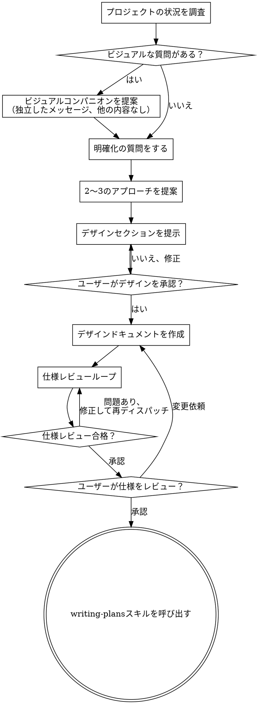

# アイデアをデザインにするブレインストーミング

自然な対話を通じて、アイデアを完全に練り上げられたデザインと仕様に変えます。

まず現在のプロジェクトの状況を把握し、次にアイデアを洗練させるために一つずつ質問します。何を構築するか理解できたら、デザインを提示してユーザーの承認を得ます。

<HARD-GATE>
デザインを提示してユーザーが承認するまで、いかなる実装スキルの呼び出し、コードの記述、プロジェクトの雛形作成、その他の実装作業も行ってはいけません。これは認識される単純さに関わらず、すべてのプロジェクトに適用されます。
</HARD-GATE>

## アンチパターン：「これはデザインが不要なほど単純だ」

すべてのプロジェクトがこのプロセスを経ます。TODOリスト、単一関数のユーティリティ、設定変更、すべてです。「単純な」プロジェクトこそ、検証されていない前提が最も多くの無駄な作業を引き起こします。デザインは短くて構いません（本当に単純なプロジェクトなら数文で十分）が、必ず提示して承認を得なければなりません。

## チェックリスト

以下の各項目についてタスクを作成し、順番に完了させなければなりません：

1. **プロジェクトの状況を調査** — ファイル、ドキュメント、最近のコミットを確認
2. **ビジュアルコンパニオンを提案**（ビジュアルに関する質問がある場合）— これは独立したメッセージであり、明確化の質問と組み合わせないこと。以下のビジュアルコンパニオンセクションを参照。
3. **明確化の質問をする** — 一度に一つずつ、目的/制約/成功基準を理解する
4. **2〜3のアプローチを提案** — トレードオフと推奨案を添えて
5. **デザインを提示** — 複雑さに応じたセクションで、各セクション後にユーザーの承認を得る
6. **デザインドキュメントを作成** — `docs/superpowers/specs/YYYY-MM-DD-<トピック>-design.md` に保存してコミット
7. **仕様レビューループ** — 正確に作成されたレビューコンテキスト（セッション履歴ではない）でspec-document-reviewerサブエージェントをディスパッチ。問題を修正し、承認されるまで再ディスパッチ（最大3回、その後は人間に相談）
8. **ユーザーが書かれた仕様をレビュー** — 進む前にユーザーに仕様ファイルのレビューを依頼
9. **実装への移行** — writing-plansスキルを呼び出して実装計画を作成

## プロセスフロー

**終了状態はwriting-plansの呼び出しです。** frontend-design、mcp-builder、その他の実装スキルを呼び出してはいけません。ブレインストーミング後に呼び出す唯一のスキルはwriting-plansです。

## プロセス

**アイデアの理解：**

- まず現在のプロジェクトの状態を確認する（ファイル、ドキュメント、最近のコミット）
- 詳細な質問をする前にスコープを評価する：リクエストが複数の独立したサブシステムを説明している場合（例：「チャット、ファイルストレージ、課金、分析を備えたプラットフォームを構築」）、すぐにこれを指摘する。分解が必要なプロジェクトの詳細を詰める質問に時間を費やさない。
- プロジェクトが単一の仕様には大きすぎる場合、ユーザーがサブプロジェクトに分解するのを支援する：独立した部分は何か、それらはどう関連するか、どの順序で構築すべきか？次に、通常のデザインフローで最初のサブプロジェクトをブレインストーミングする。各サブプロジェクトは独自の仕様→計画→実装サイクルを持つ。
- 適切なスコープのプロジェクトについては、一度に一つずつ質問してアイデアを洗練する
- 可能な場合は選択式の質問を優先するが、自由回答も可
- 1メッセージにつき1つの質問のみ — トピックがさらなる探索を必要とする場合は、複数の質問に分割する
- 理解に集中する：目的、制約、成功基準

**アプローチの探索：**

- トレードオフ付きで2〜3の異なるアプローチを提案する
- 推奨案と理由を添えて、会話形式で選択肢を提示する
- 推奨する選択肢を先に示し、理由を説明する

**デザインの提示：**

- 何を構築するか理解できたと確信したら、デザインを提示する
- 各セクションを複雑さに応じてスケーリングする：単純なら数文、繊細な場合は200〜300語まで
- 各セクションの後に、これまでの内容が正しいか確認する
- カバーする内容：アーキテクチャ、コンポーネント、データフロー、エラーハンドリング、テスト
- 何かわからないことがあれば、戻って明確にする準備をする

**分離と明確さのための設計：**

- システムを、それぞれが一つの明確な目的を持ち、明確に定義されたインターフェースを通じて通信し、独立して理解・テストできる小さなユニットに分割する
- 各ユニットについて、以下に答えられるべき：何をするか、どう使うか、何に依存するか？
- 内部実装を読まずにユニットが何をするか理解できるか？内部を変更してもコンシューマーを壊さないか？そうでなければ、境界の見直しが必要。
- より小さく、境界が明確なユニットは作業もしやすい — コンテキストに収まるコードについてより良く推論でき、ファイルが集中していると編集がより確実になる。ファイルが大きくなったら、やりすぎのサインであることが多い。

**既存コードベースでの作業：**

- 変更を提案する前に現在の構造を調査する。既存のパターンに従う。
- 既存のコードに作業に影響する問題がある場合（例：肥大化したファイル、不明確な境界、絡み合った責任）、デザインの一部として的を絞った改善を含める — 良い開発者が作業中のコードを改善するように。
- 関係のないリファクタリングを提案しない。現在の目標に寄与するものに集中する。

## デザインの後

**ドキュメント：**

- 検証済みのデザイン（仕様）を `docs/superpowers/specs/YYYY-MM-DD-<トピック>-design.md` に保存する
  - （仕様の保存場所に関するユーザーの好みはこのデフォルトを上書きする）
- 利用可能であればelements-of-style:writing-clearly-and-conciselyスキルを使用する
- デザインドキュメントをgitにコミットする

**仕様レビューループ：**
仕様ドキュメントを書いた後：

1. spec-document-reviewerサブエージェントをディスパッチする（spec-document-reviewer-prompt.mdを参照）
2. 問題が見つかった場合：修正し、再ディスパッチし、承認されるまで繰り返す
3. ループが3回を超えた場合、人間に相談する

**ユーザーレビューゲート：**
仕様レビューループが通過した後、進む前にユーザーに書かれた仕様のレビューを依頼する：

> 「仕様を作成し `<パス>` にコミットしました。実装計画の作成に進む前に、内容をレビューして変更があればお知らせください。」

ユーザーの応答を待つ。変更を求められた場合は、変更を行い仕様レビューループを再実行する。ユーザーが承認してから初めて進む。

**実装：**

- writing-plansスキルを呼び出して詳細な実装計画を作成する
- 他のスキルを呼び出してはいけない。writing-plansが次のステップ。

## 基本原則

- **一度に一つの質問** - 複数の質問で圧倒しない
- **選択式を優先** - 可能な場合、自由回答よりも答えやすい
- **YAGNIを徹底** - すべてのデザインから不要な機能を削除
- **代替案を探る** - 決定前に必ず2〜3のアプローチを提案
- **段階的な検証** - デザインを提示し、次に進む前に承認を得る
- **柔軟に対応** - 理解できないことがあれば戻って明確にする

## ビジュアルコンパニオン

ブレインストーミング中にモックアップ、図表、ビジュアルオプションを表示するためのブラウザベースのコンパニオン。ツールとして利用可能 — モードではない。コンパニオンを受け入れることは、ビジュアルな扱いが有益な質問に利用可能であることを意味する。すべての質問がブラウザを経由するわけではない。

**コンパニオンの提案：** 今後の質問にビジュアルコンテンツ（モックアップ、レイアウト、図表）が含まれると予想される場合、同意を得るために一度提案する：
> 「これから作業する内容の一部は、ウェブブラウザで表示すると説明しやすいかもしれません。進行中にモックアップ、図表、比較、その他のビジュアルを作成できます。この機能はまだ新しく、トークンを多く消費する可能性があります。試してみますか？（ローカルURLを開く必要があります）」

**この提案は独立したメッセージでなければなりません。** 明確化の質問、コンテキストの要約、その他のコンテンツと組み合わせないでください。メッセージには上記の提案のみを含め、他には何も含めないでください。ユーザーの応答を待ってから続行してください。辞退された場合は、テキストのみのブレインストーミングで進めてください。

**質問ごとの判断：** ユーザーが受け入れた後も、各質問ごとにブラウザかターミナルかを判断する。テスト：**ユーザーは読むよりも見た方が理解しやすいか？**

- **ブラウザを使用** — ビジュアルなコンテンツの場合 — モックアップ、ワイヤーフレーム、レイアウト比較、アーキテクチャ図、並べたビジュアルデザイン
- **ターミナルを使用** — テキストのコンテンツの場合 — 要件の質問、概念的な選択、トレードオフリスト、A/B/C/Dテキストオプション、スコープの決定

UIトピックに関する質問が自動的にビジュアルな質問になるわけではない。「この文脈でパーソナリティとは何を意味しますか？」は概念的な質問 — ターミナルを使用。「どちらのウィザードレイアウトが良いですか？」はビジュアルな質問 — ブラウザを使用。

コンパニオンに同意された場合、進む前に詳細ガイドを読む：
`skills/brainstorming/visual-companion.md`
