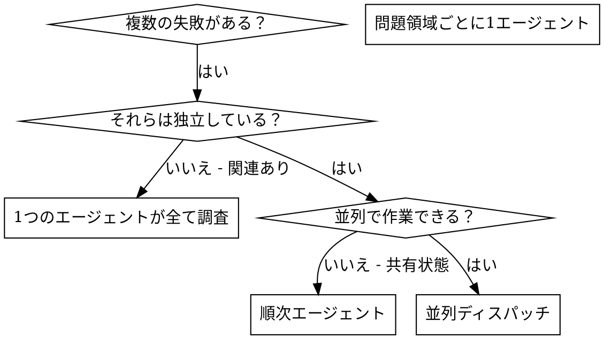

# 並列エージェントのディスパッチ

## 概要

タスクを専門エージェントに隔離されたコンテキストで委任します。指示とコンテキストを正確に作成することで、エージェントが集中して成功できるようにします。エージェントがセッションのコンテキストや履歴を引き継がないようにし、必要なものだけを構築して渡します。これにより、自分自身のコンテキストも調整作業のために保たれます。

複数の無関係な失敗（異なるテストファイル、異なるサブシステム、異なるバグ）がある場合、順番に調査するのは時間の無駄です。各調査は独立しており、並列で実行できます。

**基本原則:** 独立した問題領域ごとに1つのエージェントをディスパッチし、並行して作業させる。

## 使用タイミング



**使用する場面:**
- 異なる根本原因で3つ以上のテストファイルが失敗している
- 複数のサブシステムが独立して壊れている
- 各問題が他のコンテキストなしに理解できる
- 調査間に共有状態がない

**使用しない場面:**
- 失敗が関連している（1つ修正すると他も修正されるかもしれない）
- システム全体の状態を把握する必要がある
- エージェントが互いに干渉する可能性がある

## パターン

### 1. 独立したドメインを特定する

失敗を壊れているものでグループ分けする:
- ファイルAのテスト: ツール承認フロー
- ファイルBのテスト: バッチ完了動作
- ファイルCのテスト: 中断機能

各ドメインは独立しています — ツール承認の修正は中断テストに影響しません。

### 2. 集中したエージェントタスクを作成する

各エージェントが受け取るもの:
- **特定のスコープ:** 1つのテストファイルまたはサブシステム
- **明確な目標:** これらのテストを通過させる
- **制約:** 他のコードを変更しない
- **期待される出力:** 発見したこととその修正のサマリ

### 3. 並列でディスパッチする

```typescript
// Claude Code / AI環境で
Task("agent-tool-abort.test.tsの失敗を修正")
Task("batch-completion-behavior.test.tsの失敗を修正")
Task("tool-approval-race-conditions.test.tsの失敗を修正")
// 3つ同時に実行
```

### 4. レビューして統合する

エージェントが戻ってきたら:
- 各サマリを読む
- 修正が競合しないことを確認する
- 完全なテストスイートを実行する
- 全ての変更を統合する

## エージェントプロンプトの構造

良いエージェントプロンプトは:
1. **集中している** - 1つの明確な問題領域
2. **自己完結している** - 問題を理解するために必要な全てのコンテキスト
3. **出力について具体的** - エージェントは何を返すべきか？

```markdown
src/agents/agent-tool-abort.test.tsの3つの失敗テストを修正してください:

1. "should abort tool with partial output capture" - メッセージに 'interrupted at' が期待される
2. "should handle mixed completed and aborted tools" - 速いツールが完了ではなく中断される
3. "should properly track pendingToolCount" - 3つの結果が期待されるが0になる

これらはタイミング/競合状態の問題です。あなたのタスク:

1. テストファイルを読んで各テストが何を検証するかを理解する
2. 根本原因を特定する — タイミングの問題か実際のバグか？
3. 以下の方法で修正する:
   - 任意のタイムアウトをイベントベースの待機に置き換える
   - 見つかった場合は中断実装のバグを修正する
   - 変更した動作をテストしている場合はテストの期待値を調整する

タイムアウトを増やすだけにしないこと — 本当の問題を見つけてください。

戻り値: 発見したことと修正したことのサマリ。
```

## よくある間違い

**❌ 広すぎる:** 「全てのテストを修正して」 — エージェントが迷子になる
**✅ 具体的:** 「agent-tool-abort.test.tsを修正して」 — 集中したスコープ

**❌ コンテキストなし:** 「競合状態を修正して」 — エージェントがどこか分からない
**✅ コンテキストあり:** エラーメッセージとテスト名を貼り付ける

**❌ 制約なし:** エージェントが全てをリファクタリングするかもしれない
**✅ 制約あり:** 「本番コードを変更しないこと」または「テストのみ修正する」

**❌ 曖昧な出力:** 「修正して」 — 何が変わったか分からない
**✅ 具体的:** 「根本原因と変更のサマリを返す」

## 使用しない場面

**関連する失敗:** 1つを修正すると他も修正されるかもしれない — まとめて調査する
**完全なコンテキストが必要:** 理解にシステム全体が必要
**探索的デバッグ:** 何が壊れているかまだ分からない
**共有状態:** エージェントが干渉する（同じファイルを編集する、同じリソースを使用する）

## セッションからの実例

**シナリオ:** 大規模リファクタリング後、3つのファイルにまたがる6つのテスト失敗

**失敗:**
- agent-tool-abort.test.ts: 3失敗（タイミングの問題）
- batch-completion-behavior.test.ts: 2失敗（ツールが実行されない）
- tool-approval-race-conditions.test.ts: 1失敗（実行回数 = 0）

**判断:** 独立したドメイン — 中断ロジックはバッチ完了とは別、競合状態とも別

**ディスパッチ:**
```
エージェント1 → agent-tool-abort.test.tsを修正
エージェント2 → batch-completion-behavior.test.tsを修正
エージェント3 → tool-approval-race-conditions.test.tsを修正
```

**結果:**
- エージェント1: タイムアウトをイベントベースの待機に置き換え
- エージェント2: イベント構造のバグを修正（threadIdが間違った場所にあった）
- エージェント3: 非同期ツール実行の完了を待つ処理を追加

**統合:** 全ての修正が独立しており、競合なし、スイート全体がグリーン

**節約された時間:** 3つの問題が順次ではなく並列で解決

## 主な利点

1. **並列化** — 複数の調査が同時に行われる
2. **集中** — 各エージェントが狭いスコープを持ち、追跡するコンテキストが少ない
3. **独立性** — エージェントが互いに干渉しない
4. **速度** — 1つの時間で3つの問題が解決される

## 検証

エージェントが戻ってきたら:
1. **各サマリをレビュー** — 何が変わったかを理解する
2. **競合をチェック** — エージェントが同じコードを編集したか？
3. **完全なスイートを実行** — 全ての修正が一緒に機能することを確認する
4. **スポットチェック** — エージェントは体系的なエラーを起こすことがある

## 実際の影響

デバッグセッション（2025-10-03）から:
- 3つのファイルにまたがる6つの失敗
- 3つのエージェントを並列でディスパッチ
- 全ての調査が並行して完了
- 全ての修正が正常に統合
- エージェントの変更間の競合ゼロ
