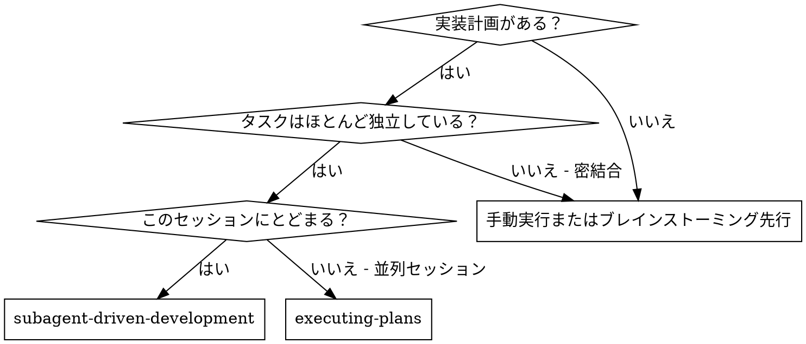
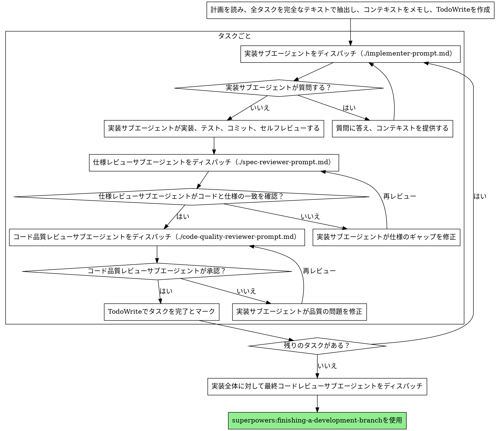

# サブエージェント駆動開発

タスクごとに新鮮なサブエージェントをディスパッチし、各タスク後に2段階レビュー（仕様準拠レビュー、次にコード品質レビュー）を実行して計画を実行します。

**サブエージェントを使う理由:** 隔離されたコンテキストを持つ専門エージェントにタスクを委任します。指示とコンテキストを正確に作成することで、エージェントが集中して成功できるようにします。エージェントがセッションのコンテキストや履歴を引き継がないようにし、必要なものだけを構築して渡します。これにより、自分自身のコンテキストも調整作業のために保たれます。

**基本原則:** タスクごとに新鮮なサブエージェント + 2段階レビュー（仕様→品質）= 高品質、高速なイテレーション

## 使用タイミング



**executing-plans（並列セッション）との比較:**
- 同じセッション（コンテキストの切り替えなし）
- タスクごとに新鮮なサブエージェント（コンテキストの汚染なし）
- 各タスク後に2段階レビュー: まず仕様準拠、次にコード品質
- 高速なイテレーション（タスク間に人間のループなし）

## プロセス



## モデルの選択

コストを節約し速度を上げるために、各役割に対して必要最小限の強力なモデルを使用します。

**機械的な実装タスク**（独立した関数、明確な仕様、1〜2ファイル）: 高速で安価なモデルを使用。計画が適切に仕様化されている場合、ほとんどの実装タスクは機械的です。

**統合と判断タスク**（複数ファイルの調整、パターンマッチング、デバッグ）: 標準モデルを使用。

**アーキテクチャ、設計、レビュータスク**: 最も有能なモデルを使用。

**タスクの複雑さのシグナル:**
- 完全な仕様で1〜2ファイルを変更 → 安価なモデル
- 統合の懸念がある複数ファイルを変更 → 標準モデル
- 設計の判断や広範なコードベースの理解が必要 → 最も有能なモデル

## 実装サブエージェントのステータスの処理

実装サブエージェントは4つのステータスのうちの1つを報告します。それぞれ適切に処理してください:

**DONE:** 仕様準拠レビューに進む。

**DONE_WITH_CONCERNS:** 実装サブエージェントが作業を完了したが疑念を表明した。進む前に懸念を読む。懸念が正確さやスコープについてのものであれば、レビュー前に対処する。観察（例：「このファイルは大きくなっています」）であれば、メモして進む。

**NEEDS_CONTEXT:** 実装サブエージェントが提供されなかった情報を必要としている。不足しているコンテキストを提供して再ディスパッチする。

**BLOCKED:** 実装サブエージェントがタスクを完了できない。ブロッカーを評価する:
1. コンテキストの問題であれば、より多くのコンテキストを提供し、同じモデルで再ディスパッチする
2. タスクがより多くの推論を必要とする場合、より有能なモデルで再ディスパッチする
3. タスクが大きすぎる場合、より小さな部分に分割する
4. 計画自体が間違っている場合、人間にエスカレートする

**絶対に** エスカレーションを無視したり、変更なしに同じモデルに再試行させたりしないでください。実装サブエージェントが行き詰まっていると言ったなら、何かを変える必要があります。

## プロンプトテンプレート

- `./implementer-prompt.md` - 実装サブエージェントをディスパッチ
- `./spec-reviewer-prompt.md` - 仕様準拠レビューサブエージェントをディスパッチ
- `./code-quality-reviewer-prompt.md` - コード品質レビューサブエージェントをディスパッチ

## ワークフロー例

```
あなた: サブエージェント駆動開発を使ってこの計画を実行します。

[計画ファイルを一度読む: docs/superpowers/plans/feature-plan.md]
[完全なテキストとコンテキストで全5タスクを抽出]
[全タスクでTodoWriteを作成]

タスク1: フックインストールスクリプト

[タスク1のテキストとコンテキストを取得（すでに抽出済み）]
[完全なタスクテキスト + コンテキストで実装サブエージェントをディスパッチ]

実装: 「始める前に — フックはユーザーレベルとシステムレベルのどちらにインストールすべきですか？」

あなた: 「ユーザーレベル（~/.config/superpowers/hooks/）」

実装: 「了解しました。実装中です...」
[後で] 実装:
  - install-hookコマンドを実装
  - テストを追加、5/5通過
  - セルフレビュー: --forceフラグを見逃していたので追加しました
  - コミット済み

[仕様準拠レビューをディスパッチ]
仕様レビュー: ✅ 仕様準拠 — 全要件を満たし、余分なものなし

[git SHAを取得し、コード品質レビューをディスパッチ]
コードレビュー: 長所: 良いテストカバレッジ、クリーン。問題: なし。承認。

[タスク1を完了とマーク]

タスク2: リカバリーモード

[タスク2のテキストとコンテキストを取得（すでに抽出済み）]
[完全なタスクテキスト + コンテキストで実装サブエージェントをディスパッチ]

実装: [質問なし、進行]
実装:
  - verify/repairモードを追加
  - 8/8テスト通過
  - セルフレビュー: 全て良好
  - コミット済み

[仕様準拠レビューをディスパッチ]
仕様レビュー: ❌ 問題:
  - 欠けている: 進捗レポート（仕様に「100項目ごとに報告」と記載）
  - 余分: --jsonフラグを追加（リクエストされていない）

[実装が問題を修正]
実装: --jsonフラグを削除し、進捗レポートを追加

[仕様レビューが再確認]
仕様レビュー: ✅ 今は仕様準拠

[コード品質レビューをディスパッチ]
コードレビュー: 長所: 堅実。問題（Important）: マジックナンバー（100）

[実装が修正]
実装: PROGRESS_INTERVAL定数を抽出

[コードレビューが再確認]
コードレビュー: ✅ 承認

[タスク2を完了とマーク]

...

[全タスク後]
[最終コードレビューをディスパッチ]
最終レビュー: 全要件を満たし、マージの準備ができています

完了！
```

## 利点

**手動実行との比較:**
- サブエージェントが自然にTDDに従う
- タスクごとに新鮮なコンテキスト（混乱なし）
- 並列安全（サブエージェントが干渉しない）
- サブエージェントが質問できる（作業前と作業中）

**executing-plansとの比較:**
- 同じセッション（ハンドオフなし）
- 継続的な進捗（待機なし）
- レビューチェックポイントが自動

**効率の向上:**
- ファイル読み込みのオーバーヘッドなし（コントローラーが完全なテキストを提供）
- コントローラーが必要なコンテキストを正確にキュレーション
- サブエージェントが最初から完全な情報を取得
- 作業前に質問が表面化（後ではなく）

**品質ゲート:**
- セルフレビューがハンドオフ前に問題をキャッチ
- 2段階レビュー: 仕様準拠、次にコード品質
- レビューループが修正が実際に機能することを確認
- 仕様準拠が過剰/不足な構築を防ぐ
- コード品質が実装が適切に構築されていることを確認

**コスト:**
- より多くのサブエージェント呼び出し（タスクごとに実装 + 2レビュアー）
- コントローラーがより多くの準備作業を行う（全タスクを事前に抽出）
- レビューループがイテレーションを増やす
- しかし早期に問題をキャッチ（後でデバッグするより安い）

## レッドフラグ

**絶対にしてはいけないこと:**
- ユーザーの明示的な同意なしにmain/masterブランチで実装を開始する
- レビュー（仕様準拠またはコード品質）をスキップする
- 未修正の問題を抱えたまま進む
- 複数の実装サブエージェントを並列でディスパッチする（競合する）
- サブエージェントに計画ファイルを読ませる（代わりに完全なテキストを提供する）
- シーン設定のコンテキストをスキップする（サブエージェントがタスクの位置を理解する必要がある）
- サブエージェントの質問を無視する（進める前に答える）
- 仕様準拠で「まあいいか」を受け入れる（仕様レビュアーが問題を見つけた = 未完了）
- レビューループをスキップする（レビュアーが問題を見つけた = 実装が修正 = 再レビュー）
- 実装サブエージェントのセルフレビューが実際のレビューを代替すると考える（両方が必要）
- **仕様準拠が✅になる前にコード品質レビューを開始する**（順序が間違っている）
- どちらかのレビューに未解決の問題がある状態で次のタスクに移動する

**サブエージェントが質問する場合:**
- 明確かつ完全に答える
- 必要に応じて追加のコンテキストを提供する
- 実装に急かさない

**レビュアーが問題を見つける場合:**
- 実装サブエージェント（同じサブエージェント）が修正する
- レビュアーが再確認する
- 承認されるまで繰り返す
- 再レビューをスキップしない

**サブエージェントがタスクに失敗した場合:**
- 特定の指示で修正サブエージェントをディスパッチする
- 手動で修正しようとしない（コンテキストの汚染）

## 連携

**必須ワークフロースキル:**
- **superpowers:using-git-worktrees** - 必須: 開始前に隔離されたワークスペースをセットアップする
- **superpowers:writing-plans** - このスキルが実行する計画を作成する
- **superpowers:requesting-code-review** - レビューサブエージェントのコードレビューテンプレート
- **superpowers:finishing-a-development-branch** - 全タスク後に開発を完了する

**サブエージェントが使うべきスキル:**
- **superpowers:test-driven-development** - サブエージェントが各タスクでTDDに従う

**代替ワークフロー:**
- **superpowers:executing-plans** - 同じセッションの実行ではなく並列セッションに使用する
