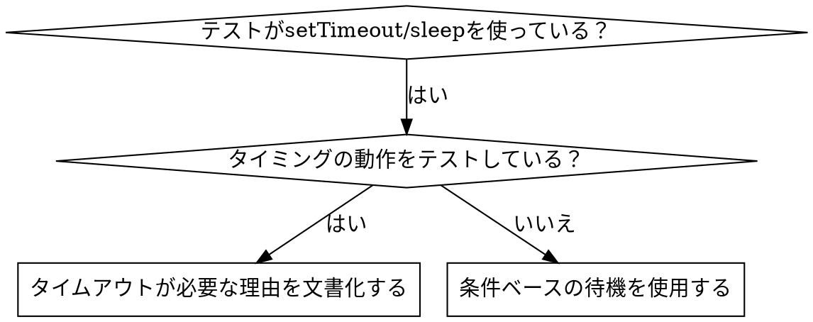

# 条件ベースの待機

## 概要

不安定なテストはしばしば任意の遅延でタイミングを推測します。これにより、速いマシンでは通過するがロード下またはCIで失敗する競合状態が生まれます。

**基本原則:** かかる時間についての推測ではなく、実際に必要とする条件を待つ。

## 使用タイミング



**使用する場面:**
- テストに任意の遅延がある（`setTimeout`、`sleep`、`time.sleep()`）
- テストが不安定（時々通過し、ロード下で失敗する）
- 並列実行時にテストがタイムアウトする
- 非同期操作の完了を待つ

**使用しない場面:**
- 実際のタイミング動作をテストする（デバウンス、スロットル間隔）
- 任意のタイムアウトを使用する場合は常にその理由を文書化する

## 基本パターン

```typescript
// ❌ 前: タイミングを推測
await new Promise(r => setTimeout(r, 50));
const result = getResult();
expect(result).toBeDefined();

// ✅ 後: 条件を待つ
await waitFor(() => getResult() !== undefined);
const result = getResult();
expect(result).toBeDefined();
```

## クイックパターン

| シナリオ | パターン |
|---------|---------|
| イベントを待つ | `waitFor(() => events.find(e => e.type === 'DONE'))` |
| 状態を待つ | `waitFor(() => machine.state === 'ready')` |
| カウントを待つ | `waitFor(() => items.length >= 5)` |
| ファイルを待つ | `waitFor(() => fs.existsSync(path))` |
| 複雑な条件 | `waitFor(() => obj.ready && obj.value > 10)` |

## 実装

汎用ポーリング関数:
```typescript
async function waitFor<T>(
  condition: () => T | undefined | null | false,
  description: string,
  timeoutMs = 5000
): Promise<T> {
  const startTime = Date.now();

  while (true) {
    const result = condition();
    if (result) return result;

    if (Date.now() - startTime > timeoutMs) {
      throw new Error(`${description}を${timeoutMs}ms後にタイムアウト`);
    }

    await new Promise(r => setTimeout(r, 10)); // 10msごとにポーリング
  }
}
```

完全な実装（`waitForEvent`、`waitForEventCount`、`waitForEventMatch`などのドメイン固有のヘルパーを含む実際のデバッグセッションから）については、このディレクトリの `condition-based-waiting-example.ts` を参照してください。

## よくある間違い

**❌ ポーリングが速すぎる:** `setTimeout(check, 1)` - CPUを無駄にする
**✅ 修正:** 10msごとにポーリングする

**❌ タイムアウトなし:** 条件が満たされない場合に無限ループ
**✅ 修正:** 明確なエラーを含むタイムアウトを常に含める

**❌ 古いデータ:** ループ前に状態をキャッシュする
**✅ 修正:** 新鮮なデータのためにループ内でゲッターを呼び出す

## 任意のタイムアウトが正しい場合

```typescript
// ツールは100msごとにティックする — 部分出力を確認するには2ティック必要
await waitForEvent(manager, 'TOOL_STARTED'); // まず: 条件を待つ
await new Promise(r => setTimeout(r, 200));   // 次に: タイミングの動作を待つ
// 200ms = 100ms間隔で2ティック — 文書化されて正当化されている
```

**要件:**
1. まずトリガー条件を待つ
2. 既知のタイミングに基づく（推測ではない）
3. なぜかを説明するコメント

## 実際の影響

デバッグセッション（2025-10-03）から:
- 3つのファイルにまたがる15の不安定なテストを修正
- 通過率: 60% → 100%
- 実行時間: 40%高速化
- 競合状態がなくなった
