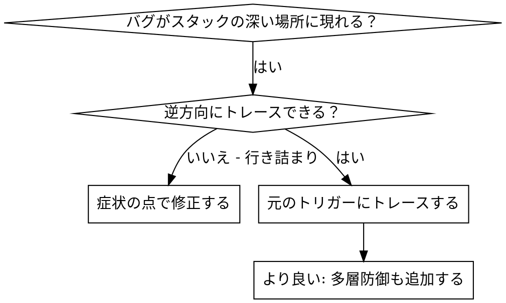
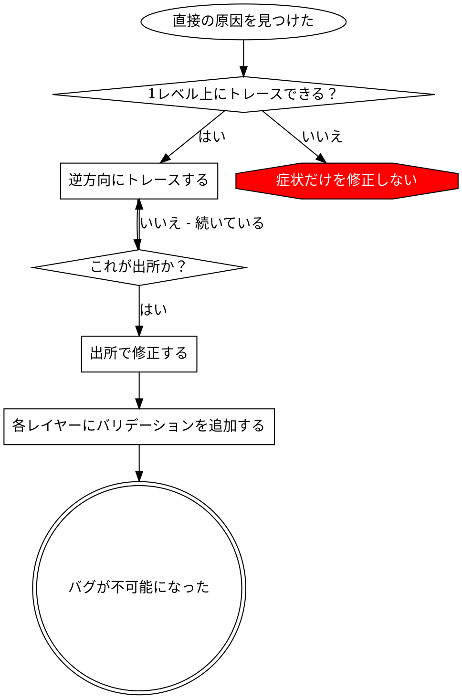

# 根本原因トレーシング

## 概要

バグはしばしばコールスタックの深い場所で現れます（間違ったディレクトリでのgit init、間違った場所に作成されたファイル、間違ったパスで開かれたデータベース）。本能的にエラーが現れた場所で修正したくなりますが、それは症状を治療していることになります。

**基本原則:** 元のトリガーを見つけるまでコールチェーンを逆方向にトレースし、出所で修正する。

## 使用タイミング



**使用する場面:**
- エラーが実行の深い場所で発生する（エントリーポイントではなく）
- スタックトレースが長いコールチェーンを示す
- 無効なデータがどこで発生したか不明確
- どのテスト/コードが問題を引き起こしているか見つける必要がある

## トレーシングプロセス

### 1. 症状を観察する
```
エラー: /Users/jesse/project/packages/coreで git init が失敗しました
```

### 2. 直接の原因を見つける
**何のコードがこれを直接引き起こしているか？**
```typescript
await execFileAsync('git', ['init'], { cwd: projectDir });
```

### 3. これを呼び出したものは？
```typescript
WorktreeManager.createSessionWorktree(projectDir, sessionId)
  → Session.initializeWorkspace() に呼び出される
  → Session.create() に呼び出される
  → Project.create() でテストに呼び出される
```

### 4. トレースし続ける
**どんな値が渡されたか？**
- `projectDir = ''`（空文字列！）
- `cwd` としての空文字列は `process.cwd()` に解決される
- それがソースコードディレクトリだ！

### 5. 元のトリガーを見つける
**空文字列はどこから来たか？**
```typescript
const context = setupCoreTest(); // { tempDir: '' } を返す
Project.create('name', context.tempDir); // beforeEach の前にアクセスされた！
```

## スタックトレースの追加

手動でトレースできない場合、インストゥルメンテーションを追加する:

```typescript
// 問題のある操作の前
async function gitInit(directory: string) {
  const stack = new Error().stack;
  console.error('DEBUG git init:', {
    directory,
    cwd: process.cwd(),
    nodeEnv: process.env.NODE_ENV,
    stack,
  });

  await execFileAsync('git', ['init'], { cwd: directory });
}
```

**重要:** テストでは `console.error()` を使用する（logger ではない — 表示されないかもしれない）

**実行してキャプチャする:**
```bash
npm test 2>&1 | grep 'DEBUG git init'
```

**スタックトレースを分析する:**
- テストファイル名を探す
- 呼び出しを引き起こしている行番号を見つける
- パターンを特定する（同じテスト？同じパラメーター？）

## どのテストが汚染を引き起こすかを見つける

テスト中に何かが現れるがどのテストか分からない場合:

このディレクトリの二分探索スクリプト `find-polluter.sh` を使用する:

```bash
./find-polluter.sh '.git' 'src/**/*.test.ts'
```

テストを1つずつ実行し、最初の汚染者で停止する。使用方法はスクリプトを参照。

## 実例: 空の projectDir

**症状:** `.git` が `packages/core/`（ソースコード）に作成される

**トレースチェーン:**
1. `git init` が `process.cwd()` で実行される ← 空の cwd パラメーター
2. WorktreeManager が空の projectDir で呼び出される
3. Session.create() が空文字列を渡された
4. テストが beforeEach の前に `context.tempDir` にアクセスした
5. setupCoreTest() が最初に `{ tempDir: '' }` を返す

**根本原因:** beforeEach の前に空の値にアクセスするトップレベルの変数初期化

**修正:** beforeEach の前にアクセスされた場合にスローするゲッターにしました

**多層防御も追加した:**
- レイヤー1: Project.create() がディレクトリを検証
- レイヤー2: WorkspaceManager が空でないことを検証
- レイヤー3: NODE_ENV ガードが tmpdir 外での git init を拒否
- レイヤー4: git init 前にスタックトレースログ

## 重要な原則



**エラーが現れた場所だけを修正しないでください。** 元のトリガーを見つけるために逆方向にトレースしてください。

## スタックトレースのヒント

**テストでは:** logger ではなく `console.error()` を使用する — logger が抑制される可能性がある
**操作の前:** 危険な操作の後ではなく前にログを記録する
**コンテキストを含める:** ディレクトリ、cwd、環境変数、タイムスタンプ
**スタックをキャプチャする:** `new Error().stack` が完全なコールチェーンを示す

## 実際の影響

デバッグセッション（2025-10-03）から:
- 5レベルのトレースを通じて根本原因を見つけた
- 出所で修正（ゲッターバリデーション）
- 4つのレイヤーの防御を追加
- 1847テストが通過し、汚染ゼロ
