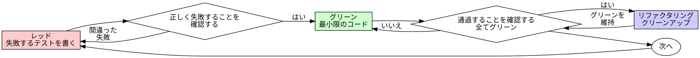

# テスト駆動開発（TDD）

## 概要

テストを先に書く。失敗を見る。通過する最小限のコードを書く。

**基本原則:** テストが失敗するのを見なかったなら、正しいことをテストしているかどうか分からない。

**このルールの文言を違反することはルールの精神を違反することです。**

## 使用タイミング

**常に:**
- 新機能
- バグ修正
- リファクタリング
- 動作の変更

**例外（パートナーに確認する）:**
- 使い捨てプロトタイプ
- 生成されたコード
- 設定ファイル

「今回だけTDDをスキップしよう」と考えていますか？止めてください。それは言い訳です。

## 鉄則

```
失敗するテストなしに本番コードを書いてはいけない
```

テストの前にコードを書いた？削除してください。最初からやり直してください。

**例外なし:**
- 「参照として」保持しない
- テストを書きながら「適応させ」ない
- 見ない
- 削除とは削除を意味する

テストから新しく実装する。以上。

## レッド-グリーン-リファクタリング



### レッド — 失敗するテストを書く

何が起きるべきかを示す1つの最小限のテストを書く。

<Good>
```typescript
test('失敗した操作を3回リトライする', async () => {
  let attempts = 0;
  const operation = () => {
    attempts++;
    if (attempts < 3) throw new Error('失敗');
    return 'success';
  };

  const result = await retryOperation(operation);

  expect(result).toBe('success');
  expect(attempts).toBe(3);
});
```
明確な名前、実際の動作をテスト、1つのこと
</Good>

<Bad>
```typescript
test('リトライが機能する', async () => {
  const mock = jest.fn()
    .mockRejectedValueOnce(new Error())
    .mockRejectedValueOnce(new Error())
    .mockResolvedValueOnce('success');
  await retryOperation(mock);
  expect(mock).toHaveBeenCalledTimes(3);
});
```
曖昧な名前、コードではなくモックをテスト
</Bad>

**要件:**
- 1つの動作
- 明確な名前
- 実際のコード（やむを得ない場合を除きモックなし）

### レッドの確認 — 失敗するのを見る

**必須。絶対にスキップしない。**

```bash
npm test path/to/test.test.ts
```

確認:
- テストが失敗する（エラーではなく）
- 失敗メッセージが期待通り
- 機能が欠けているために失敗する（タイポではなく）

**テストが通過する？** 既存の動作をテストしている。テストを修正する。

**テストがエラーになる？** エラーを修正し、正しく失敗するまで再実行する。

### グリーン — 最小限のコード

テストを通過する最もシンプルなコードを書く。

<Good>
```typescript
async function retryOperation<T>(fn: () => Promise<T>): Promise<T> {
  for (let i = 0; i < 3; i++) {
    try {
      return await fn();
    } catch (e) {
      if (i === 2) throw e;
    }
  }
  throw new Error('到達不能');
}
```
通過するのに十分なだけ
</Good>

<Bad>
```typescript
async function retryOperation<T>(
  fn: () => Promise<T>,
  options?: {
    maxRetries?: number;
    backoff?: 'linear' | 'exponential';
    onRetry?: (attempt: number) => void;
  }
): Promise<T> {
  // YAGNI
}
```
過剰設計
</Bad>

テストを超えて機能を追加したり、他のコードをリファクタリングしたり、「改善」したりしない。

### グリーンの確認 — 通過するのを見る

**必須。**

```bash
npm test path/to/test.test.ts
```

確認:
- テストが通過する
- 他のテストも通過する
- 出力がクリーン（エラー、警告なし）

**テストが失敗する？** テストではなくコードを修正する。

**他のテストが失敗する？** 今すぐ修正する。

### リファクタリング — クリーンアップ

グリーンになった後のみ:
- 重複を削除する
- 名前を改善する
- ヘルパーを抽出する

テストをグリーンに保つ。動作を追加しない。

### 繰り返す

次の機能の次の失敗するテスト。

## 良いテスト

| 品質 | 良い | 悪い |
|------|------|------|
| **最小限** | 1つのこと。名前に「and」がある？分割する。 | `test('メールとドメインと空白を検証する')` |
| **明確** | 名前が動作を説明する | `test('test1')` |
| **意図を示す** | 望ましいAPIを示す | コードが何をすべきかを曖昧にする |

## 順序が重要な理由

**「後でテストを書いて確認しよう」**

後から書いたテストはすぐに通過する。すぐに通過することは何も証明しない:
- 間違ったことをテストしているかもしれない
- 動作ではなく実装をテストしているかもしれない
- 忘れたエッジケースを見逃しているかもしれない
- バグをキャッチするのを見なかった

テストを先に書くことで失敗するのを見ることが強制され、実際に何かをテストしていることが証明される。

**「全てのエッジケースを手動でテストした」**

手動テストはアドホックです。全てをテストしたと思っても:
- 何をテストしたかの記録がない
- コードが変わった時に再実行できない
- プレッシャー下でケースを忘れやすい
- 「試したら機能した」 ≠ 包括的

自動テストは体系的です。毎回同じ方法で実行される。

**「X時間の作業を削除するのは無駄だ」**

サンクコストの錯覚です。時間はすでに消えています。今の選択:
- 削除してTDDで書き直す（Xさらに時間、高い信頼性）
- そのまま保持して後でテストを追加する（30分、低い信頼性、バグの可能性が高い）

「無駄」は信頼できないコードを保持することです。実際のテストなしの動作するコードは技術的負債です。

**「TDDは教条主義的、実用的であることはその適応を意味する」**

TDDこそが実用的です:
- コミット前にバグを見つける（後でデバッグするより速い）
- 回帰を防ぐ（テストが壊れを即座にキャッチ）
- 動作を文書化する（テストがコードの使い方を示す）
- リファクタリングを可能にする（自由に変更、テストが壊れをキャッチ）

「実用的な」ショートカット = 本番でのデバッグ = 遅くなる。

**「後からのテストも同じ目標を達成する — 精神であって儀式ではない」**

違います。テスト後は「これは何をするか？」に答えます。テスト先は「これは何をすべきか？」に答えます。

後からのテストは実装に偏っています。構築したものをテストし、必要なものではありません。覚えているエッジケースを確認しますが、発見されたものは確認しません。

テスト先は実装前にエッジケースの発見を強制します。テスト後は全てを覚えていることを確認します（覚えていません）。

30分のテスト後 ≠ TDD。カバレッジは得られますが、テストが機能する証明は失います。

## よくある言い訳

| 言い訳 | 現実 |
|--------|------|
| 「テストするには単純すぎる」 | 単純なコードは壊れる。テストは30秒かかる。 |
| 「後でテストしよう」 | すぐに通過するテストは何も証明しない。 |
| 「後からのテストも同じ目標を達成する」 | テスト後 = 「これは何をするか？」テスト先 = 「これは何をすべきか？」 |
| 「既に手動でテストした」 | アドホック ≠ 体系的。記録なし、再実行不可。 |
| 「X時間を削除するのは無駄だ」 | サンクコストの錯覚。未確認のコードを保持することが技術的負債。 |
| 「参照として保持して先にテストを書く」 | 適応させることになる。それはテスト後。削除とは削除を意味する。 |
| 「まず探索する必要がある」 | OK。探索を捨てて、TDDで始める。 |
| 「テストが難しい = 設計が不明確」 | テストに耳を傾ける。テストしにくい = 使いにくい。 |
| 「TDDは遅くなる」 | TDDはデバッグより速い。実用的 = テスト先。 |
| 「手動テストが速い」 | 手動はエッジケースを証明しない。変更のたびに再テストする。 |
| 「既存のコードにテストがない」 | 改善している。既存コードにテストを追加する。 |

## レッドフラグ — 停止してやり直す

- テストの前にコード
- 実装後のテスト
- テストがすぐに通過する
- テストがなぜ失敗したか説明できない
- 「後で」追加されたテスト
- 「今回だけ」と言い訳する
- 「既に手動でテストした」
- 「後からのテストも同じ目的を達成する」
- 「精神であって儀式ではない」
- 「参照として保持する」または「既存のコードを適応させる」
- 「既にX時間かけた、削除するのは無駄だ」
- 「TDDは教条主義的、実用的になっている」
- 「これは違う、なぜなら...」

**これら全ての意味: コードを削除。TDDでやり直す。**

## 例: バグ修正

**バグ:** 空のメールが受け入れられる

**レッド**
```typescript
test('空のメールを拒否する', async () => {
  const result = await submitForm({ email: '' });
  expect(result.error).toBe('メールが必要です');
});
```

**レッドの確認**
```bash
$ npm test
失敗: expected 'メールが必要です', got undefined
```

**グリーン**
```typescript
function submitForm(data: FormData) {
  if (!data.email?.trim()) {
    return { error: 'メールが必要です' };
  }
  // ...
}
```

**グリーンの確認**
```bash
$ npm test
通過
```

**リファクタリング**
必要であれば複数フィールドのバリデーションを抽出する。

## 検証チェックリスト

作業を完了とマークする前に:

- [ ] 全ての新しい関数/メソッドにテストがある
- [ ] 実装前に各テストが失敗するのを見た
- [ ] 各テストが期待される理由で失敗した（機能の欠落、タイポではない）
- [ ] 各テストを通過する最小限のコードを書いた
- [ ] 全テストが通過する
- [ ] 出力がクリーン（エラー、警告なし）
- [ ] テストが実際のコードを使用する（やむを得ない場合のみモック）
- [ ] エッジケースとエラーがカバーされている

全てのボックスをチェックできない？TDDをスキップした。やり直す。

## 行き詰まった時

| 問題 | 解決策 |
|------|--------|
| テストの方法が分からない | 望みのAPIを書く。最初にアサーションを書く。パートナーに確認する。 |
| テストが複雑すぎる | 設計が複雑すぎる。インターフェースを簡素化する。 |
| 全てをモックしなければならない | コードが密結合すぎる。依存性注入を使用する。 |
| テストのセットアップが巨大 | ヘルパーを抽出する。それでも複雑？設計を簡素化する。 |

## デバッグとの統合

バグが見つかった？バグを再現する失敗テストを書く。TDDサイクルに従う。テストが修正を証明し、回帰を防ぐ。

テストなしにバグを修正しないこと。

## テストのアンチパターン

モックやテストユーティリティを追加する際、よくある落とし穴を避けるために @testing-anti-patterns.md を読む:
- モックの動作ではなく実際の動作をテストする
- 本番クラスにテスト専用メソッドを追加する
- 依存関係を理解せずにモックする

## 最終ルール

```
本番コード → テストが存在し、最初に失敗した
そうでなければ → TDDではない
```

パートナーの許可なしに例外なし。
