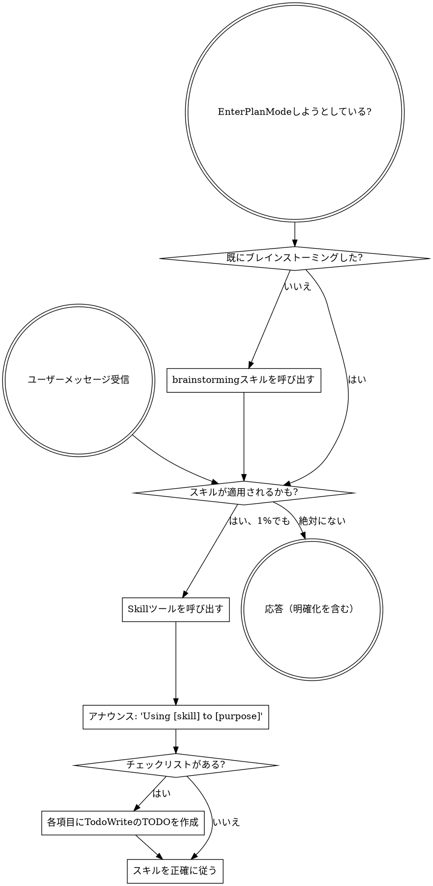

<SUBAGENT-STOP>
特定のタスクを実行するサブエージェントとして派遣された場合は、このスキルをスキップしてください。
</SUBAGENT-STOP>

<EXTREMELY-IMPORTANT>
あなたが行っていることにスキルが適用される可能性が1%でもあると思う場合、そのスキルを絶対に呼び出さなければなりません。

スキルがタスクに適用される場合、あなたに選択肢はありません。必ず使用しなければなりません。

これは交渉の余地がありません。これはオプションではありません。これを合理化で回避することはできません。
</EXTREMELY-IMPORTANT>

## 指示の優先順位

Superpowersスキルはデフォルトのシステムプロンプト動作を上書きしますが、**ユーザーの指示が常に優先されます**：

1. **ユーザーの明示的な指示**（CLAUDE.md、GEMINI.md、AGENTS.md、直接のリクエスト）— 最高優先度
2. **Superpowersスキル** — 競合する場合はデフォルトのシステム動作を上書き
3. **デフォルトのシステムプロンプト** — 最低優先度

CLAUDE.md、GEMINI.md、またはAGENTS.mdに「TDDを使用しない」とあり、スキルに「常にTDDを使用する」とある場合は、ユーザーの指示に従ってください。ユーザーがコントロールします。

## スキルへのアクセス方法

**Claude Codeの場合:** `Skill`ツールを使用。スキルを呼び出すとその内容がロードされて提示されます — 直接それに従ってください。スキルファイルにReadツールを使用しないでください。

**Gemini CLIの場合:** スキルは`activate_skill`ツールで有効化されます。Geminiはセッション開始時にスキルメタデータをロードし、要求に応じて全コンテンツを有効化します。

**その他の環境:** スキルのロード方法についてはプラットフォームのドキュメントを確認してください。

## プラットフォーム適応

スキルはClaude Codeのツール名を使用します。CC以外のプラットフォーム: ツールの対応については`references/codex-tools.md`（Codex）を参照。Gemini CLIユーザーはGEMINI.md経由でツールマッピングが自動的にロードされます。

# スキルの使用

## ルール

**関連する、またはリクエストされたスキルをあらゆる応答やアクションの前に呼び出す。** スキルが適用されるかもしれない1%の可能性でも、確認のためにスキルを呼び出すべきです。呼び出したスキルが状況に合わなかった場合は使用しなくて構いません。

## レッドフラグ

以下の考えは停止のサインです — 合理化しています：

| 考え | 現実 |
|---------|---------|
| 「これは単純な質問」 | 質問はタスクです。スキルを確認してください。 |
| 「まずより多くのコンテキストが必要」 | スキル確認は明確化の質問の前に来ます。 |
| 「まずコードベースを探索する」 | スキルは探索の方法を教えます。先に確認してください。 |
| 「git/ファイルを素早く確認できる」 | ファイルには会話のコンテキストがありません。スキルを確認してください。 |
| 「まず情報を収集する」 | スキルは情報収集の方法を教えます。 |
| 「正式なスキルは必要ない」 | スキルが存在する場合は使用してください。 |
| 「このスキルは覚えている」 | スキルは進化します。現在のバージョンを読んでください。 |
| 「これはタスクとしてカウントされない」 | アクション = タスク。スキルを確認してください。 |
| 「スキルは過剰」 | シンプルなことは複雑になります。使用してください。 |
| 「まずこれ一つだけやる」 | 何かをする前に確認してください。 |
| 「これは生産的に感じる」 | 規律のないアクションは時間を無駄にします。スキルがこれを防ぎます。 |
| 「その意味は知っている」 | 概念を知ること ≠ スキルを使用すること。呼び出してください。 |

## スキルの優先順位

複数のスキルが適用できる場合、この順序を使用：

1. **プロセススキルを先に**（brainstorming、debugging）- タスクへのアプローチ方法を決定
2. **実装スキルを次に**（frontend-design、mcp-builder）- 実行をガイド

「Xを構築しよう」 → まずbrainstorming、次に実装スキル。
「このバグを修正」 → まずdebugging、次にドメイン固有スキル。

## スキルの種類

**厳格型**（TDD、debugging）: 正確に従う。規律を適応で逃げない。

**柔軟型**（パターン）: 原則をコンテキストに適応。

スキル自体がどちらかを示しています。

## ユーザーの指示

指示は「何を」であり、「どのように」ではありません。「Xを追加」や「Yを修正」はワークフローをスキップするという意味ではありません。
