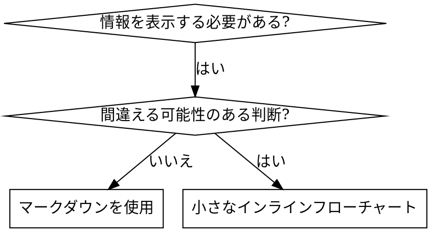

# スキルの作成

## 概要

**スキルの作成はプロセスドキュメントに適用されたテスト駆動開発（TDD）です。**

**個人スキルはエージェント固有のディレクトリに配置されます（Claude Codeの場合は`~/.claude/skills`、Codexの場合は`~/.agents/skills/`）**

テストケース（サブエージェントによるプレッシャーシナリオ）を書き、失敗を確認し（ベースライン動作）、スキル（ドキュメント）を書き、テスト通過を確認し（エージェントが従う）、リファクタリング（抜け穴を塞ぐ）します。

**核心原則:** スキルなしでエージェントが失敗するのを見ていなければ、そのスキルが正しいことを教えているかどうかわかりません。

**必須前提知識:** このスキルを使用する前に、superpowers:test-driven-developmentを理解している必要があります。そのスキルは基本的なRED-GREEN-REFACTORサイクルを定義しています。このスキルはTDDをドキュメントに適用したものです。

**公式ガイダンス:** Anthropicの公式スキル作成ベストプラクティスについては、anthropic-best-practices.mdを参照してください。このドキュメントは、このスキルのTDD重視アプローチを補完する追加のパターンとガイドラインを提供します。

## スキルとは何か？

**スキル**は、実証済みのテクニック、パターン、またはツールのリファレンスガイドです。スキルは将来のClaudeインスタンスが効果的なアプローチを見つけて適用するのに役立ちます。

**スキルとは:** 再利用可能なテクニック、パターン、ツール、リファレンスガイド

**スキルではないもの:** ある問題を一度どう解決したかの物語

## スキルのTDDマッピング

| TDDの概念 | スキル作成 |
|-------------|----------------|
| **テストケース** | サブエージェントによるプレッシャーシナリオ |
| **プロダクションコード** | スキルドキュメント（SKILL.md） |
| **テスト失敗（RED）** | スキルなしでエージェントがルール違反（ベースライン） |
| **テスト通過（GREEN）** | スキルありでエージェントが従う |
| **リファクタリング** | コンプライアンスを維持しながら抜け穴を塞ぐ |
| **テストを先に書く** | スキルを書く前にベースラインシナリオを実行 |
| **失敗を見る** | エージェントが使う正確な合理化を文書化 |
| **最小限のコード** | それらの具体的な違反に対処するスキルを書く |
| **通過を見る** | エージェントが従うことを確認 |
| **リファクタリングサイクル** | 新しい合理化を見つける → 塞ぐ → 再検証 |

スキル作成プロセス全体がRED-GREEN-REFACTORに従います。

## スキルを作成すべきタイミング

**作成すべき場合：**
- テクニックが直感的に明らかでなかった
- プロジェクトを超えて再び参照する
- パターンが広く適用される（プロジェクト固有でない）
- 他の人にも有益

**作成すべきでない場合：**
- 一回限りのソリューション
- 他で十分に文書化されている標準的なプラクティス
- プロジェクト固有の規約（CLAUDE.mdに記載）
- 機械的な制約（正規表現/バリデーションで強制可能なら自動化する — ドキュメントは判断を要する場面のために残す）

## スキルの種類

### テクニック
従うべきステップを持つ具体的な方法（condition-based-waiting、root-cause-tracing）

### パターン
問題の考え方（flatten-with-flags、test-invariants）

### リファレンス
APIドキュメント、構文ガイド、ツールのドキュメント（officeドキュメント）

## ディレクトリ構造


```
skills/
  skill-name/
    SKILL.md              # メインリファレンス（必須）
    supporting-file.*     # 必要な場合のみ
```

**フラットな名前空間** - すべてのスキルが1つの検索可能な名前空間内

**別ファイルにすべき場合：**
1. **大量のリファレンス**（100行以上）- APIドキュメント、包括的な構文
2. **再利用可能なツール** - スクリプト、ユーティリティ、テンプレート

**インラインに保持：**
- 原則と概念
- コードパターン（50行未満）
- その他すべて

## SKILL.mdの構造

**フロントマター（YAML）：**
- サポートされるフィールドは`name`と`description`の2つのみ
- 合計最大1024文字
- `name`: 英数字とハイフンのみ使用（括弧や特殊文字は不可）
- `description`: 三人称で、使用タイミングのみを記述（何をするかではない）
  - 「Use when...」で始めてトリガー条件に焦点を当てる
  - 具体的な症状、状況、コンテキストを含める
  - **スキルのプロセスやワークフローを要約しないこと**（理由はCSO セクションを参照）
  - 可能であれば500文字未満に抑える

```markdown
---
name: Skill-Name-With-Hyphens
description: Use when [具体的なトリガー条件と症状]
---

# スキル名

## 概要
これは何か？核心原則を1〜2文で。

## 使用タイミング
[決定が自明でない場合、小さなインラインフローチャート]

症状とユースケースの箇条書き
使用しない場合

## コアパターン（テクニック/パターン向け）
ビフォー/アフターのコード比較

## クイックリファレンス
一般的な操作をスキャンするためのテーブルまたは箇条書き

## 実装
シンプルなパターンはインラインコード
大量のリファレンスや再利用可能なツールはファイルへのリンク

## よくある間違い
何が問題になるか + 修正方法

## 実際の影響（オプション）
具体的な結果
```


## Claude検索最適化（CSO）

**発見可能性にとって重要:** 将来のClaudeがあなたのスキルを見つける必要があります

### 1. 充実したDescriptionフィールド

**目的:** Claudeは与えられたタスクに対してどのスキルをロードするかを決定するためにdescriptionを読みます。「今このスキルを読むべきか？」という問いに答えるようにしてください。

**形式:** 「Use when...」で始めてトリガー条件に焦点を当てる

**重要: Description = 使用タイミング、スキルの内容ではない**

descriptionにはトリガー条件のみを記述すべきです。descriptionにスキルのプロセスやワークフローを要約しないでください。

**なぜこれが重要か:** テストで、descriptionがスキルのワークフローを要約していると、Claudeが完全なスキル内容を読む代わりにdescriptionに従うことが判明しました。「タスク間のコードレビュー」というdescriptionにより、スキルのフローチャートで明確に2回のレビュー（仕様準拠とコード品質）を示していたにもかかわらず、Claudeは1回のレビューしか行いませんでした。

descriptionを「Use when executing implementation plans with independent tasks」（ワークフロー要約なし）に変更したところ、Claudeはフローチャートを正しく読み、二段階レビュープロセスに従いました。

**罠:** ワークフローを要約するdescriptionはClaudeが使うショートカットを作成します。スキル本文はClaudeがスキップするドキュメントになります。

```yaml
# ❌ 悪い例: ワークフローを要約 - Claudeがスキルを読む代わりにこれに従う可能性
description: Use when executing plans - dispatches subagent per task with code review between tasks

# ❌ 悪い例: プロセスの詳細が多すぎる
description: Use for TDD - write test first, watch it fail, write minimal code, refactor

# ✅ 良い例: トリガー条件のみ、ワークフロー要約なし
description: Use when executing implementation plans with independent tasks in the current session

# ✅ 良い例: トリガー条件のみ
description: Use when implementing any feature or bugfix, before writing implementation code
```

**内容:**
- このスキルが適用されることを示す具体的なトリガー、症状、状況を使用
- *言語固有の症状*（setTimeout、sleep）ではなく*問題*（レース条件、一貫性のない動作）を記述
- スキル自体が技術固有でない限り、トリガーは技術に依存しないものに
- スキルが技術固有の場合、トリガーでそれを明示
- 三人称で記述（システムプロンプトに挿入されるため）
- **スキルのプロセスやワークフローを要約しないこと**

```yaml
# ❌ 悪い例: 抽象的すぎる、曖昧、使用タイミングが含まれていない
description: For async testing

# ❌ 悪い例: 一人称
description: I can help you with async tests when they're flaky

# ❌ 悪い例: 技術に言及しているがスキルはそれに固有ではない
description: Use when tests use setTimeout/sleep and are flaky

# ✅ 良い例: 「Use when」で始まり、問題を記述、ワークフローなし
description: Use when tests have race conditions, timing dependencies, or pass/fail inconsistently

# ✅ 良い例: 技術固有のスキルで明示的なトリガー
description: Use when using React Router and handling authentication redirects
```

### 2. キーワードカバレッジ

Claudeが検索するであろう単語を使用：
- エラーメッセージ: "Hook timed out"、"ENOTEMPTY"、"race condition"
- 症状: "flaky"、"hanging"、"zombie"、"pollution"
- 同義語: "timeout/hang/freeze"、"cleanup/teardown/afterEach"
- ツール: 実際のコマンド、ライブラリ名、ファイルタイプ

### 3. 説明的な命名

**能動態、動詞先頭を使用：**
- ✅ `creating-skills` not `skill-creation`
- ✅ `condition-based-waiting` not `async-test-helpers`

### 4. トークン効率（重要）

**問題:** getting-startedや頻繁に参照されるスキルはすべての会話にロードされます。すべてのトークンが重要です。

**目標ワード数：**
- getting-startedワークフロー: 各150ワード未満
- 頻繁にロードされるスキル: 合計200ワード未満
- その他のスキル: 500ワード未満（それでも簡潔に）

**テクニック：**

**詳細をツールヘルプに移動：**
```bash
# ❌ 悪い例: SKILL.mdにすべてのフラグを文書化
search-conversations supports --text, --both, --after DATE, --before DATE, --limit N

# ✅ 良い例: --helpを参照
search-conversations supports multiple modes and filters. Run --help for details.
```

**クロスリファレンスを使用：**
```markdown
# ❌ 悪い例: ワークフローの詳細を繰り返す
When searching, dispatch subagent with template...
[20行の繰り返し指示]

# ✅ 良い例: 他のスキルを参照
Always use subagents (50-100x context savings). REQUIRED: Use [other-skill-name] for workflow.
```

**例を圧縮：**
```markdown
# ❌ 悪い例: 冗長な例（42ワード）
your human partner: "How did we handle authentication errors in React Router before?"
You: I'll search past conversations for React Router authentication patterns.
[Dispatch subagent with search query: "React Router authentication error handling 401"]

# ✅ 良い例: 最小限の例（20ワード）
Partner: "How did we handle auth errors in React Router?"
You: Searching...
[Dispatch subagent → synthesis]
```

**冗長性を排除：**
- クロスリファレンスされたスキルにあることを繰り返さない
- コマンドから明らかなことを説明しない
- 同じパターンの複数の例を含めない

**検証：**
```bash
wc -w skills/path/SKILL.md
# getting-startedワークフロー: 各150未満を目指す
# その他の頻繁にロードされるもの: 合計200未満を目指す
```

**行っていることまたは核心的な洞察で命名：**
- ✅ `condition-based-waiting` > `async-test-helpers`
- ✅ `using-skills` not `skill-usage`
- ✅ `flatten-with-flags` > `data-structure-refactoring`
- ✅ `root-cause-tracing` > `debugging-techniques`

**動名詞（-ing）はプロセスに適している：**
- `creating-skills`、`testing-skills`、`debugging-with-logs`
- 能動的で、行っているアクションを記述

### 4. 他のスキルのクロスリファレンス

**他のスキルを参照するドキュメントを書く場合：**

スキル名のみを使用し、明示的な要件マーカーを付ける：
- ✅ 良い例: `**REQUIRED SUB-SKILL:** Use superpowers:test-driven-development`
- ✅ 良い例: `**REQUIRED BACKGROUND:** You MUST understand superpowers:systematic-debugging`
- ❌ 悪い例: `See skills/testing/test-driven-development`（必須かどうか不明確）
- ❌ 悪い例: `@skills/testing/test-driven-development/SKILL.md`（強制ロード、コンテキストを消費）

**@リンクを使わない理由:** `@`構文はファイルを即座に強制ロードし、必要になる前に200k以上のコンテキストを消費します。

## フローチャートの使用



**フローチャートを使用するのは以下の場合のみ：**
- 自明でない判断ポイント
- 早く止めてしまう可能性のあるプロセスループ
- 「AとBのどちらを使うか」の判断

**フローチャートを使用しない場合：**
- リファレンス資料 → テーブル、リスト
- コード例 → マークダウンブロック
- 線形的な指示 → 番号付きリスト
- 意味のないラベル（step1、helper2）

graphvizのスタイルルールについては @graphviz-conventions.dot を参照。

**人間のパートナーへの可視化：** このディレクトリの`render-graphs.js`を使用してスキルのフローチャートをSVGにレンダリング：
```bash
./render-graphs.js ../some-skill           # 各ダイアグラムを個別に
./render-graphs.js ../some-skill --combine # すべてのダイアグラムを1つのSVGに
```

## コード例

**1つの優れた例が多くの平凡な例に勝る**

最も関連性の高い言語を選択：
- テスト技法 → TypeScript/JavaScript
- システムデバッグ → Shell/Python
- データ処理 → Python

**良い例：**
- 完全で実行可能
- WHYを説明するコメント付き
- 実際のシナリオから
- パターンを明確に示す
- 適応可能（汎用テンプレートではない）

**してはいけないこと：**
- 5以上の言語で実装
- 穴埋めテンプレートを作成
- 不自然な例を書く

ポーティングは得意です — 1つの優れた例で十分。

## ファイル構成

### 自己完結型スキル
```
defense-in-depth/
  SKILL.md    # すべてインライン
```
条件: すべてのコンテンツが収まり、大量のリファレンスが不要な場合

### 再利用可能なツール付きスキル
```
condition-based-waiting/
  SKILL.md    # 概要 + パターン
  example.ts  # 適応するための動作するヘルパー
```
条件: ツールが再利用可能なコードで、単なる説明ではない場合

### 大量のリファレンス付きスキル
```
pptx/
  SKILL.md       # 概要 + ワークフロー
  pptxgenjs.md   # 600行のAPIリファレンス
  ooxml.md       # 500行のXML構造
  scripts/       # 実行可能なツール
```
条件: リファレンス資料がインラインには大きすぎる場合

## 鉄の掟（TDDと同じ）

```
失敗するテストなしにスキルを作成してはならない
```

これは新しいスキルと既存スキルの編集の両方に適用されます。

テスト前にスキルを書いた？削除。最初からやり直し。
テストなしでスキルを編集した？同じ違反。

**例外なし：**
- 「シンプルな追加」でも
- 「セクションを追加するだけ」でも
- 「ドキュメントの更新」でも
- テストされていない変更を「参考」として保持しない
- テスト実行中に「適応」しない
- 削除は削除を意味する

**必須前提知識:** superpowers:test-driven-developmentスキルがなぜこれが重要かを説明しています。同じ原則がドキュメントにも適用されます。

## すべてのスキルタイプのテスト

異なるスキルタイプには異なるテストアプローチが必要：

### 規律強制型スキル（ルール/要件）

**例：** TDD、verification-before-completion、designing-before-coding

**テスト方法：**
- 学術的な質問: ルールを理解しているか？
- プレッシャーシナリオ: ストレス下で従うか？
- 複数のプレッシャーの組み合わせ: 時間 + 埋没コスト + 疲労
- 合理化を特定し、明示的な対策を追加

**成功基準:** 最大プレッシャー下でエージェントがルールに従う

### テクニック型スキル（ハウツーガイド）

**例：** condition-based-waiting、root-cause-tracing、defensive-programming

**テスト方法：**
- 適用シナリオ: テクニックを正しく適用できるか？
- バリエーションシナリオ: エッジケースを処理できるか？
- 情報不足テスト: 指示にギャップがあるか？

**成功基準:** エージェントが新しいシナリオにテクニックを正常に適用

### パターン型スキル（メンタルモデル）

**例：** reducing-complexity、information-hidingの概念

**テスト方法：**
- 認識シナリオ: パターンが適用される場面を認識できるか？
- 適用シナリオ: メンタルモデルを使用できるか？
- 反例: 適用すべきでない場面を知っているか？

**成功基準:** エージェントがパターンの適用タイミングと方法を正しく特定

### リファレンス型スキル（ドキュメント/API）

**例：** APIドキュメント、コマンドリファレンス、ライブラリガイド

**テスト方法：**
- 検索シナリオ: 正しい情報を見つけられるか？
- 適用シナリオ: 見つけた情報を正しく使用できるか？
- ギャップテスト: 一般的なユースケースがカバーされているか？

**成功基準:** エージェントがリファレンス情報を見つけて正しく適用

## テストをスキップする一般的な合理化

| 言い訳 | 現実 |
|--------|---------|
| 「スキルは明らかに明確」 | あなたにとって明確 ≠ 他のエージェントにとって明確。テストすべき。 |
| 「単なるリファレンス」 | リファレンにもギャップや不明確なセクションがある。検索をテスト。 |
| 「テストは過剰」 | テストされていないスキルには問題がある。常に。15分のテストで数時間を節約。 |
| 「問題が出たらテストする」 | 問題 = エージェントがスキルを使えない。デプロイ前にテスト。 |
| 「テストは面倒」 | テストは本番で問題のあるスキルをデバッグするよりも面倒ではない。 |
| 「良いものだと確信している」 | 過信は問題を保証する。とにかくテスト。 |
| 「学術的なレビューで十分」 | 読むこと ≠ 使うこと。適用シナリオをテスト。 |
| 「テストする時間がない」 | テストされていないスキルをデプロイすると、後で修正するのにもっと時間がかかる。 |

**これらすべての意味: デプロイ前にテスト。例外なし。**

## 合理化に対するスキルの強化

規律を強制するスキル（TDDなど）は合理化に抵抗する必要があります。エージェントは賢く、プレッシャー下で抜け穴を見つけます。

**心理学メモ:** なぜ説得テクニックが機能するかを理解することで、それらを体系的に適用できます。権威、コミットメント、希少性、社会的証明、一体性の原則に関する研究基盤（Cialdini, 2021; Meincke et al., 2025）については、persuasion-principles.mdを参照してください。

### すべての抜け穴を明示的に塞ぐ

ルールを述べるだけでなく、具体的な回避策を禁止する：

<Bad>
```markdown
テスト前にコードを書いた？削除。
```
</Bad>

<Good>
```markdown
テスト前にコードを書いた？削除。最初からやり直し。

**例外なし：**
- 「参考」として保持しない
- テストを書きながら「適応」しない
- 見ない
- 削除は削除を意味する
```
</Good>

### 「精神対文言」の議論に対処

基本原則を早期に追加：

```markdown
**ルールの文言に違反することは、ルールの精神に違反することです。**
```

これにより「精神に従っている」という合理化のクラス全体を遮断します。

### 合理化テーブルの構築

ベースラインテスト（以下のテストセクションを参照）から合理化を記録。エージェントが作るすべての言い訳がテーブルに入ります：

```markdown
| 言い訳 | 現実 |
|--------|---------|
| 「テストするには単純すぎる」 | 単純なコードも壊れる。テストは30秒。 |
| 「後でテストする」 | すぐに通過するテストは何も証明しない。 |
| 「後のテストでも同じ目的を達成」 | 後のテスト = 「これは何をする？」 先のテスト = 「これは何をすべきか？」 |
```

### レッドフラグリストの作成

エージェントが合理化しているときに自己チェックしやすくする：

```markdown
## レッドフラグ - 停止してやり直し

- テスト前のコード
- 「手動でテスト済み」
- 「後のテストでも同じ目的を達成」
- 「精神の問題であり儀式ではない」
- 「これは違う、なぜなら...」

**これらすべての意味: コードを削除。TDDでやり直し。**
```

### 違反症状のCSO更新

descriptionに追加: ルール違反しそうな症状：

```yaml
description: use when implementing any feature or bugfix, before writing implementation code
```

違反しそうな症状を追加。

## スキルのRED-GREEN-REFACTOR

TDDサイクルに従う：

### RED: 失敗するテストを書く（ベースライン）

スキルなしでサブエージェントにプレッシャーシナリオを実行。正確な動作を文書化：
- どんな選択をしたか？
- どんな合理化を使ったか（そのまま記録）？
- どのプレッシャーが違反を引き起こしたか？

これが「テストの失敗を見る」 — スキルを書く前にエージェントが自然に何をするかを見なければなりません。

### GREEN: 最小限のスキルを書く

それらの具体的な合理化に対処するスキルを書く。仮定のケースのための追加コンテンツは加えない。

スキルありで同じシナリオを実行。エージェントが従うはず。

### REFACTOR: 抜け穴を塞ぐ

エージェントが新しい合理化を見つけた？明示的な対策を追加。防弾になるまで再テスト。

**テスト方法論:** 完全なテスト方法論については@testing-skills-with-subagents.mdを参照：
- プレッシャーシナリオの書き方
- プレッシャーの種類（時間、埋没コスト、権威、疲労）
- 体系的な穴の塞ぎ方
- メタテスト技法

## アンチパターン

### ❌ 物語的な例
"2025-10-03のセッションで、空のprojectDirが原因で..."
**問題:** 特定すぎて再利用不可

### ❌ 多言語の希釈
example-js.js、example-py.py、example-go.go
**問題:** 品質が低く、メンテナンス負担

### ❌ フローチャート内のコード
```dot
step1 [label="import fs"];
step2 [label="read file"];
```
**問題:** コピー＆ペーストできない、読みにくい

### ❌ 汎用的なラベル
helper1、helper2、step3、pattern4
**問題:** ラベルには意味的な意味があるべき

## 停止: 次のスキルに進む前に

**スキルを書いた後は、必ず停止してデプロイプロセスを完了してください。**

**してはいけないこと：**
- テストせずに複数のスキルをバッチ作成
- 現在のスキルが検証される前に次のスキルに進む
- 「バッチ処理の方が効率的」だからテストをスキップ

**以下のデプロイチェックリストは各スキルに対して必須です。**

テストされていないスキルのデプロイ = テストされていないコードのデプロイ。品質基準の違反です。

## スキル作成チェックリスト（TDD適用版）

**重要: 以下の各チェックリスト項目に対してTodoWriteでTODOを作成してください。**

**REDフェーズ - 失敗するテストを書く：**
- [ ] プレッシャーシナリオを作成（規律型スキルは3つ以上の組み合わせプレッシャー）
- [ ] スキルなしでシナリオを実行 - ベースライン動作をそのまま文書化
- [ ] 合理化/失敗のパターンを特定

**GREENフェーズ - 最小限のスキルを書く：**
- [ ] nameは英数字とハイフンのみ使用（括弧/特殊文字なし）
- [ ] YAMLフロントマターにnameとdescriptionのみ（最大1024文字）
- [ ] descriptionは「Use when...」で始まり、具体的なトリガー/症状を含む
- [ ] descriptionは三人称で記述
- [ ] 検索用キーワードを全体に（エラー、症状、ツール）
- [ ] 核心原則を含む明確な概要
- [ ] REDで特定された具体的なベースライン失敗に対処
- [ ] コードはインラインまたは別ファイルへのリンク
- [ ] 1つの優れた例（多言語ではない）
- [ ] スキルありでシナリオを実行 - エージェントが従うことを確認

**REFACTORフェーズ - 抜け穴を塞ぐ：**
- [ ] テストから新しい合理化を特定
- [ ] 各抜け穴に明示的な対策を追加（規律型スキルの場合）
- [ ] すべてのテストイテレーションから合理化テーブルを構築
- [ ] レッドフラグリストを作成
- [ ] 防弾になるまで再テスト

**品質チェック：**
- [ ] 判断が自明でない場合のみ小さなフローチャート
- [ ] クイックリファレンステーブル
- [ ] よくある間違いセクション
- [ ] 物語的な記述なし
- [ ] サポートファイルはツールまたは大量のリファレンスの場合のみ

**デプロイ：**
- [ ] スキルをgitにコミットしてフォークにプッシュ（設定されている場合）
- [ ] PR経由での貢献を検討（広く有用な場合）

## 発見ワークフロー

将来のClaudeがスキルを見つける方法：

1. **問題に遭遇**（「テストが不安定」）
3. **スキルを見つける**（descriptionが一致）
4. **概要をスキャン**（これは関連性があるか？）
5. **パターンを読む**（クイックリファレンステーブル）
6. **例をロード**（実装時のみ）

**このフローに最適化** - 検索可能な用語を早い段階で頻繁に配置。

## 結論

**スキルの作成はプロセスドキュメントのTDDです。**

同じ鉄の掟: 失敗するテストなしにスキルを作成しない。
同じサイクル: RED（ベースライン）→ GREEN（スキル作成）→ REFACTOR（抜け穴を塞ぐ）。
同じ利点: より高い品質、少ないサプライズ、防弾の結果。

コードにTDDを適用するなら、スキルにも適用する。ドキュメントに適用された同じ規律です。
